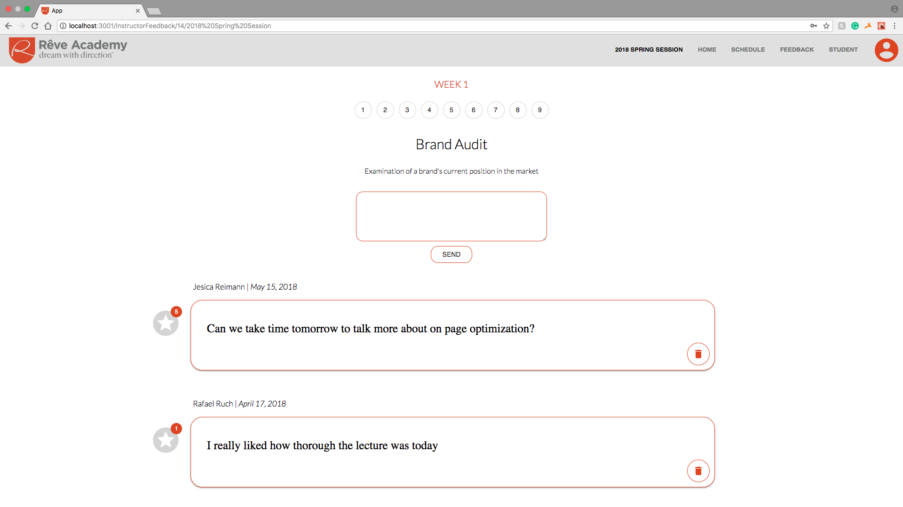
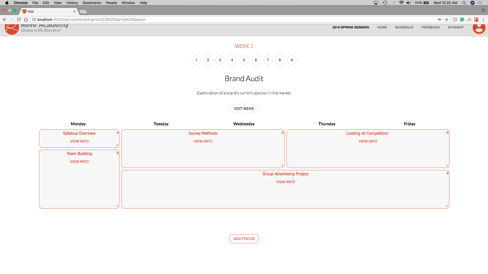

# Rêve Voices Application

Link to Heroku: revevoices.herokuapp.com/user

## Technologies and Frameworks Used
* Material-UI/core
* Express
* Node.js
* Moment.js
* Passport.js
* postgreSQL
* React, Redux
* Nodemailer, xoauth2


## Getting Started

These instructions will get you a copy of the project up and running on your local machine for development and testing purposes. These directions are specific to the deployment document given to Rêve Academy which includes the sensitive login information. In order to create your own login information, you will need to set up an account with the Gmail OAuth API. To help, directions to set that up have been linked in this document process.

### Prerequisites

Link to software that is required to install the app.

- [Node.js](https://nodejs.org/en/)
- [Express.is](https://expressjs.com/)
- [postgreSQL](https://www.postgresql.org/download/)

### Installing

1. To get the development enviroment running, create a database in postgreSQL called reveAcademy. (This is set in the pool.js file)
1. Copy this table into the postgreSQL queries: 

```sql
CREATE TABLE program (
	id SERIAL PRIMARY KEY,
	name VARCHAR (250) NOT NULL,
	active_program BOOLEAN DEFAULT TRUE,
	description VARCHAR (5000),
	start TIMESTAMP,
	finish TIMESTAMP
);

CREATE TABLE person (
    id SERIAL PRIMARY KEY,
    username VARCHAR (80) UNIQUE NOT NULL,
    password VARCHAR (1000) NOT NULL,
    first VARCHAR (100),
    last VARCHAR (100),
    photo VARCHAR (250),
    high_school VARCHAR (200) DEFAULT 'Pending...',
    instructor BOOLEAN DEFAULT FALSE,
    active_profile BOOLEAN DEFAULT TRUE,
    program_id INT REFERENCES program ON DELETE SET NULL,
    team VARCHAR (100), 
	token VARCHAR (100)
);

CREATE TABLE weeks (
	id SERIAL PRIMARY KEY,
	number INT,
	theme VARCHAR (250),
	description VARCHAR (5000),
	program_id INT REFERENCES program ON DELETE CASCADE,
	current_week BOOLEAN DEFAULT FALSE
);

CREATE TABLE comments(
	id SERIAL PRIMARY KEY,
	person_id INT REFERENCES person ON DELETE CASCADE,
	comment VARCHAR (500),
	date TIMESTAMP,
	week_id INT REFERENCES weeks ON DELETE CASCADE
);

CREATE TABLE likes (
	person_id INT REFERENCES person ON DELETE CASCADE,
	comment_id INT REFERENCES comments ON DELETE CASCADE
);

CREATE TABLE focus(
	id SERIAL PRIMARY KEY,
	name VARCHAR(100),
	summary VARCHAR(5000),
	week_id INT REFERENCES weeks ON DELETE CASCADE,
	x INT,
	y INT,
	w INT,
	h INT
);

CREATE TABLE strategies(
	id SERIAL PRIMARY KEY,
	title VARCHAR (100),
	summary VARCHAR (1000),
	focus_id INT REFERENCES focus ON DELETE CASCADE
);

CREATE TABLE resources (
	id SERIAL PRIMARY KEY,
	link VARCHAR (500),
	strategy_id INT REFERENCES strategies ON DELETE CASCADE
);

```

2. To download all the required dependancies in the package.json run: 
```
npm install
```
3. To run the development environment on your local machine, in the terminal run: 
```
npm run server
```
4. Then open a second tab in the terminal and run: 
```
npm run client
```
6. You must set up your own OAuth gmail and aquire a CLIENT_ID, CLIENT_SECRET, and REFRESH_TOKEN from the gmail API. Here is the set of directions that we used to set this up: http://masashi-k.blogspot.com/2013/06/sending-mail-with-gmail-using-xoauth2.html

7. Create a .env file as a root file in the application. Copy and paste the API keys into the file. The 3 keys are the CLIENT_ID, CLIENT_SECRET, and REFRESH_TOKEN that you aquired from gmail. You also need to create a SERVER_SESSION_SECRET variable with a random, secure string. After these steps, you're .env file should look like this: 
```
SERVER_SESSION_SECRET = yourRandonStringHere
CLIENT_ID = yourGmailClientIdHere
CLIENT_SECRET = yourClientSecretHere
REFRESH_TOKEN = yourRefreshTokenHere
```
8. You will need to update the email in two places in the code (forgotPassword.router and manageAccounts.router) to your email. 
9. The link sent to new users is currently under the revevoices.herokuapp.com/user, you will need to change this to your localhost. 

## Login Information

Now that the application is running on your local machine, you are sent to a login page. There are two types of login accounts (Student and Admin). Admin's have the ability to update any account to an admin account. 

Because this application is set up specifically for Rêve Academy, they have been issued specific email and login information. The email currently being used is: reveacademy.register@gmail.com

In order to make this specific to your local machine, you will need to create an inital admin account in the database: 

```sql
Insert into "person ("username", "password", "instructor") VALUES ("yourEmail", "anyValue", "true")
```
- the username must be your email, the password can be anything at this moment because it will be updated, and instructor must be set to true. 

2. Then, in the application you will need to go through the "Forgot your password?" process, send an email to yourself, click the link specific to your local machine, and reset your password. Then, you will have access to the application as an instructor. 
3. To create a student account, create a program, click on the manage accounts tab, and click "Create User" here, you will input an email and the student's information and the student will get a registration link. 

****If this is not working, check that you have the correct variables in your .env file 

## Screen Shots


Student Feedback View 




Student Calendar View





### Completed Features

High level list of items completed.

- [x] Admin's are able to create new users by sending a link to student emails
- [x] New users are able to register for their account by the email link sent to them
- [x] Users are able to change their password
- [x] Admin's are able to update user information on the "Manage Accounts" page
- [x] Admin's are able to add and update programs 
- [x] Admin's are able to create week schedules and view student comments 
- [x] Students are able to add comments to specific weeks in their program 
- [x] Students are able to view their program schedules

### Next Steps
- [ ] Allow Admin's to edit what team and program students are in
- [ ] Allow Admin's to sort their search for student's on the manage accounts page (This list will grow as more user's are added and there needs to be some function to sort this information)
- [ ] Sort deactivated student accounts separately from active accounts
- [ ] Allow Admin's to add and edit week themes and descriptions
- [ ] Adjust Styling for mobile 


## Creators of this Application: 

* Ian Carthey github.com/iancarthey
* Tenzin Chosang github.com/Tenzin1993
* Kam Kubesh github.com/KKubesh
* Melody Massard github.com/Melody8988
* Sam Trapskin github.com/Samtrapskin

## Acknowledgments

For login authentication we used this repo to begin working with Passport.js:
https://github.com/PrimeAcademy/prime-solo-project/tree/sql-starter

